A3
================
Konrad Smyth
25/11/2021

``` r
df <- read.csv('melbourne.csv')

df <- df[complete.cases(df[ , c("Date","Minimum.temperature..Deg.C.","Maximum.Temperature..Deg.C.","Evaporation..mm.","X9am.relative.humidity....")]), ]
```

``` r
df$Month <- format(as.Date(df$Date,format="%Y-%m-%d"), format = "%m")

df$DayofWeek <- wday(df$Date)

df  <- 
  df %>%
  mutate(Month = factor(Month),
         DayofWeek = factor(DayofWeek))
  
str(df)
```

    ## 'data.frame':    357 obs. of  23 variables:
    ##  $ Date                             : chr  "2019-01-1" "2019-01-2" "2019-01-3" "2019-01-4" ...
    ##  $ Minimum.temperature..Deg.C.      : num  15.5 18.4 15.9 18 17.4 14.6 17.1 16.7 16.1 13.5 ...
    ##  $ Maximum.Temperature..Deg.C.      : num  26.2 22.2 29.5 42.6 21.2 22.1 23.1 24.1 20.5 21.4 ...
    ##  $ Rainfall..mm.                    : num  0 0 0 0 0.4 1.4 0 0 0.6 0 ...
    ##  $ Evaporation..mm.                 : num  7 7 6.6 7.8 15.4 6.4 9 7.2 7.4 8.2 ...
    ##  $ Sunshine..hours.                 : num  11 7.5 9.3 12.2 5.8 13.3 11.1 10.7 12.5 11.2 ...
    ##  $ Direction.of.maximum.wind.gust   : chr  "S" "SSW" "SSW" "NW" ...
    ##  $ Speed.of.maximum.wind.gust..km.h.: int  35 39 26 54 39 33 39 43 37 31 ...
    ##  $ Time.of.maximum.wind.gust        : chr  "17:44:00" "15:23:00" "14:53:00" "12:03:00" ...
    ##  $ X9am.Temperature..Deg.C.         : num  19.8 19.5 18.1 29.5 18 17.7 19.1 20.2 17.8 16.9 ...
    ##  $ X9am.relative.humidity....       : int  74 64 75 31 63 55 55 72 62 53 ...
    ##  $ X9am.cloud.amount..oktas.        : int  7 8 8 0 7 1 6 7 5 7 ...
    ##  $ X9am.wind.direction              : chr  "S" "SSE" "S" "NNE" ...
    ##  $ X9am.wind.speed..km.h.           : chr  "6" "7" "2" "9" ...
    ##  $ X9am.MSL.pressure..hPa.          : num  1013 1014 1013 1006 1014 ...
    ##  $ X3pm.Temperature..Deg.C.         : num  24.4 21.4 24.6 42 19.1 20.6 22.2 23.5 19.3 20.6 ...
    ##  $ X3pm.relative.humidity....       : int  45 62 60 16 58 48 60 60 46 50 ...
    ##  $ X3pm.cloud.amount..oktas.        : int  1 1 0 1 7 1 5 3 3 5 ...
    ##  $ X3pm.wind.direction              : chr  "SSW" "SSW" "SSW" "NW" ...
    ##  $ X3pm.wind.speed..km.h.           : int  11 19 13 15 11 13 15 13 15 17 ...
    ##  $ X3pm.MSL.pressure..hPa.          : num  1012 1013 1010 1001 1013 ...
    ##  $ Month                            : Factor w/ 12 levels "01","02","03",..: 1 1 1 1 1 1 1 1 1 1 ...
    ##  $ DayofWeek                        : Factor w/ 7 levels "1","2","3","4",..: 3 4 5 6 7 1 2 3 4 5 ...

``` r
ggplot(df, aes(x=Month, y=Evaporation..mm.)) + geom_boxplot()
```

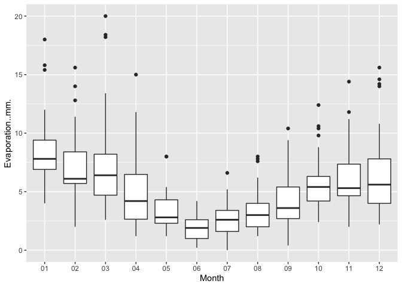<!-- --> There is clearly
a relationship between Month and Evaporation. The relationship shape is
approximately a cyclical wave. Evaporation is highest in late Summer
(Month 01) dropping each month to the lowest point in Early Winter
(Month 06), then rising gradually month on month to the high again in
Month 01 the following year.

``` r
ggplot(df, aes(x=DayofWeek, y=Evaporation..mm.)) + geom_boxplot()
```

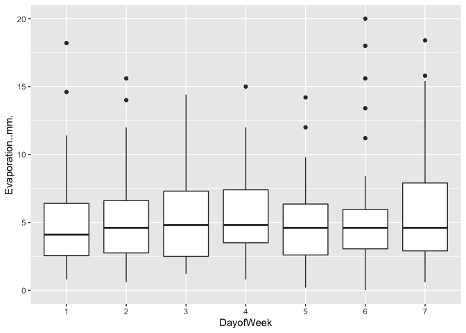<!-- --> The plot shows a
no strong relationship between Dayof Week and Evaporation. This makes
sense logically, as unlike Months which can be associated with Seasons,
Days of the Week are not associated with any particular weather events,
all seasons get 13 sets of Days 1 to 7, so the seasonal weather effects
will average out.

``` r
ggplot(df, aes(x=Evaporation..mm.)) + geom_histogram()
```

    ## `stat_bin()` using `bins = 30`. Pick better value with `binwidth`.

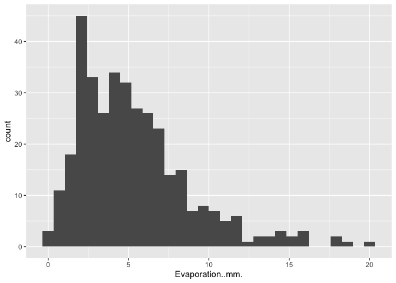<!-- --> The target
variable looks to be right skewed based on the histogram.

``` r
skewness(df$Evaporation..mm.)
```

    ## [1] 1.323286

Calculating the skewness value of Evaporation, a value higher than 1
indicates highly right skewed data, which matches with the histogram.
Given Evaporation can also not be negative, this is the kind of variable
that will benefit from a log transformation to noramlize it.

``` r
df$Log_Evaporation <- log(df$Evaporation..mm.)

df$Log_Evaporation[which(!is.finite(df$Log_Evaporation))] <- 0
```

``` r
ggplot(df, aes(x=Log_Evaporation)) + geom_histogram()
```

    ## `stat_bin()` using `bins = 30`. Pick better value with `binwidth`.

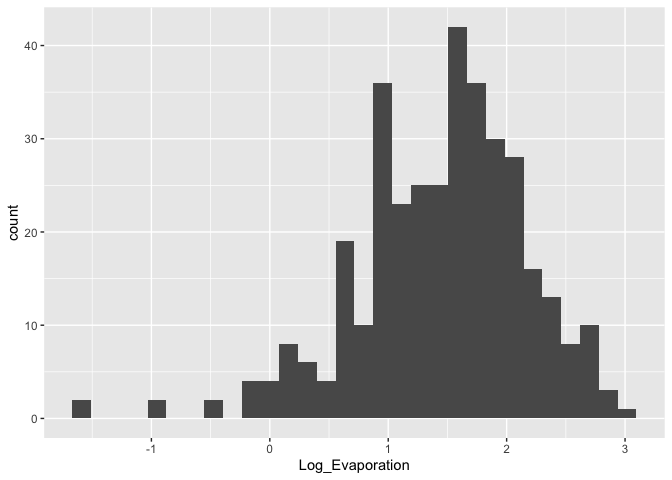<!-- -->

``` r
ggplot(df, aes(x=Minimum.temperature..Deg.C. , y=Log_Evaporation)) + geom_point() + geom_smooth(method = "lm")
```

    ## `geom_smooth()` using formula 'y ~ x'

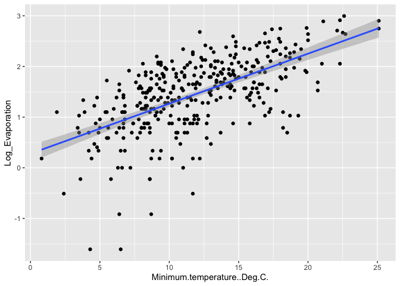<!-- -->

The plot shows a strong positive linear relationship between Maximum
Temperature and Evaporation, however with a high degree of variation.
This is logical, as heat is a catalyst for evaporation physically. This
is the same principle why you blow dry your hair with hot air instead of
cold air.

``` r
ggplot(df, aes(x=Maximum.Temperature..Deg.C. , y=Log_Evaporation)) + geom_point() + geom_smooth(method = "lm")
```

    ## `geom_smooth()` using formula 'y ~ x'

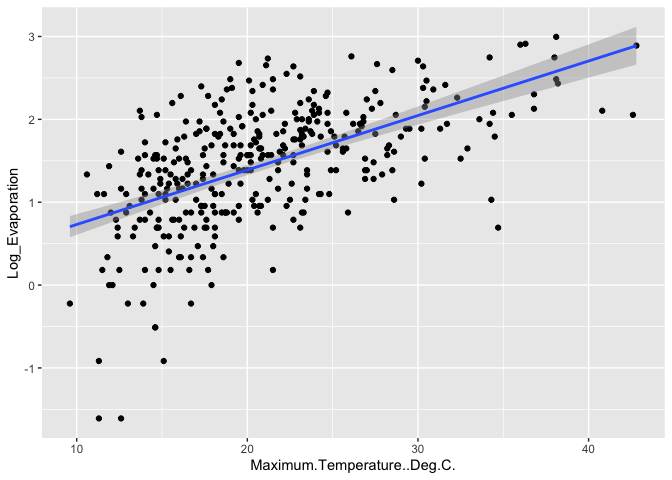<!-- -->

The plot shows a a strong positive linear relationship between Maximum
Temperature and Evaporation, however with a high degree of variation.
This is a very similar relationship to Minimum Temperature.

``` r
ggplot(df, aes(x=X9am.relative.humidity.... , y=Log_Evaporation)) + geom_point() + geom_smooth(method = "lm")
```

    ## `geom_smooth()` using formula 'y ~ x'

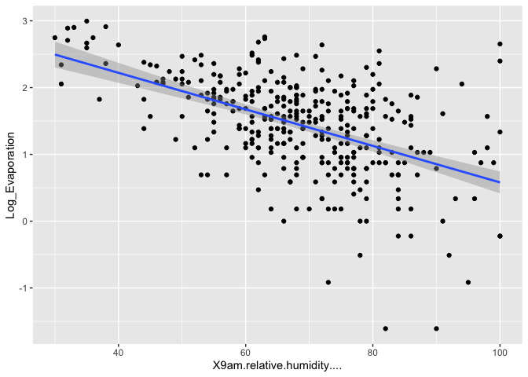<!-- --> There is a clear
negative linear relationship between average daily humidity and
evaporation. There is also evidence of heteroscedasticity, meaning error
variance is not similar along the model. This needs to be kept in mind
as in linear modelling, significance typically relies on modelling
errors having similar variances.

``` r
model1 <- lm(Log_Evaporation ~ Minimum.temperature..Deg.C. + Maximum.Temperature..Deg.C. + X9am.relative.humidity.... + Month + DayofWeek,  data = df)

summary(model1)
```

    ## 
    ## Call:
    ## lm(formula = Log_Evaporation ~ Minimum.temperature..Deg.C. + 
    ##     Maximum.Temperature..Deg.C. + X9am.relative.humidity.... + 
    ##     Month + DayofWeek, data = df)
    ## 
    ## Residuals:
    ##      Min       1Q   Median       3Q      Max 
    ## -1.93999 -0.24956  0.04403  0.27609  1.49809 
    ## 
    ## Coefficients:
    ##                              Estimate Std. Error t value Pr(>|t|)    
    ## (Intercept)                  2.270757   0.291719   7.784 8.77e-14 ***
    ## Minimum.temperature..Deg.C.  0.051286   0.009164   5.596 4.55e-08 ***
    ## Maximum.Temperature..Deg.C.  0.003014   0.006352   0.474  0.63548    
    ## X9am.relative.humidity....  -0.017925   0.002056  -8.718  < 2e-16 ***
    ## Month02                     -0.074949   0.121324  -0.618  0.53715    
    ## Month03                     -0.070588   0.119532  -0.591  0.55523    
    ## Month04                     -0.288484   0.129276  -2.232  0.02631 *  
    ## Month05                     -0.429610   0.137510  -3.124  0.00194 ** 
    ## Month06                     -0.835682   0.149683  -5.583 4.88e-08 ***
    ## Month07                     -0.631069   0.160258  -3.938 1.00e-04 ***
    ## Month08                     -0.357724   0.155576  -2.299  0.02210 *  
    ## Month09                     -0.315905   0.150582  -2.098  0.03666 *  
    ## Month10                     -0.054294   0.131782  -0.412  0.68060    
    ## Month11                     -0.035873   0.127801  -0.281  0.77912    
    ## Month12                     -0.138596   0.120945  -1.146  0.25263    
    ## DayofWeek2                  -0.007189   0.090736  -0.079  0.93690    
    ## DayofWeek3                   0.038115   0.091495   0.417  0.67725    
    ## DayofWeek4                   0.042897   0.091581   0.468  0.63980    
    ## DayofWeek5                  -0.114795   0.091372  -1.256  0.20986    
    ## DayofWeek6                  -0.114301   0.091910  -1.244  0.21451    
    ## DayofWeek7                   0.120497   0.090953   1.325  0.18613    
    ## ---
    ## Signif. codes:  0 '***' 0.001 '**' 0.01 '*' 0.05 '.' 0.1 ' ' 1
    ## 
    ## Residual standard error: 0.4603 on 336 degrees of freedom
    ## Multiple R-squared:  0.6173, Adjusted R-squared:  0.5945 
    ## F-statistic:  27.1 on 20 and 336 DF,  p-value: < 2.2e-16

``` r
anova(model1)
```

    ## Analysis of Variance Table
    ## 
    ## Response: Log_Evaporation
    ##                              Df Sum Sq Mean Sq  F value    Pr(>F)    
    ## Minimum.temperature..Deg.C.   1 70.807  70.807 334.1644 < 2.2e-16 ***
    ## Maximum.Temperature..Deg.C.   1  6.706   6.706  31.6498 3.893e-08 ***
    ## X9am.relative.humidity....    1 21.905  21.905 103.3765 < 2.2e-16 ***
    ## Month                        11 13.253   1.205   5.6858 2.075e-08 ***
    ## DayofWeek                     6  2.173   0.362   1.7095    0.1179    
    ## Residuals                   336 71.196   0.212                       
    ## ---
    ## Signif. codes:  0 '***' 0.001 '**' 0.01 '*' 0.05 '.' 0.1 ' ' 1

The Variance Table shows that ‘DayofWeek’ is not a significant
predictor. It’s P value is 0.1179, which is higher than the typical test
for significance at 0.05. This is exactly what we would expect
logically, and what was shown by the box-plot. We will remove this
variable to form a new model.

``` r
model2 <- lm(Log_Evaporation ~ Minimum.temperature..Deg.C. + Maximum.Temperature..Deg.C. + X9am.relative.humidity.... + Month,  data = df)

summary(model2)
```

    ## 
    ## Call:
    ## lm(formula = Log_Evaporation ~ Minimum.temperature..Deg.C. + 
    ##     Maximum.Temperature..Deg.C. + X9am.relative.humidity.... + 
    ##     Month, data = df)
    ## 
    ## Residuals:
    ##      Min       1Q   Median       3Q      Max 
    ## -2.06067 -0.23984  0.04412  0.26954  1.37165 
    ## 
    ## Coefficients:
    ##                               Estimate Std. Error t value Pr(>|t|)    
    ## (Intercept)                  2.2818645  0.2872680   7.943 2.87e-14 ***
    ## Minimum.temperature..Deg.C.  0.0535625  0.0091084   5.881 9.73e-09 ***
    ## Maximum.Temperature..Deg.C.  0.0008225  0.0063217   0.130  0.89656    
    ## X9am.relative.humidity....  -0.0178362  0.0020660  -8.633 2.30e-16 ***
    ## Month02                     -0.0757478  0.1220176  -0.621  0.53515    
    ## Month03                     -0.0723900  0.1201013  -0.603  0.54708    
    ## Month04                     -0.2880195  0.1297783  -2.219  0.02712 *  
    ## Month05                     -0.4428641  0.1379553  -3.210  0.00145 ** 
    ## Month06                     -0.8395518  0.1501130  -5.593 4.58e-08 ***
    ## Month07                     -0.6363000  0.1605041  -3.964 8.96e-05 ***
    ## Month08                     -0.3687359  0.1559605  -2.364  0.01862 *  
    ## Month09                     -0.3138606  0.1511240  -2.077  0.03856 *  
    ## Month10                     -0.0519812  0.1322800  -0.393  0.69459    
    ## Month11                     -0.0455773  0.1283581  -0.355  0.72275    
    ## Month12                     -0.1302240  0.1215046  -1.072  0.28458    
    ## ---
    ## Signif. codes:  0 '***' 0.001 '**' 0.01 '*' 0.05 '.' 0.1 ' ' 1
    ## 
    ## Residual standard error: 0.4632 on 342 degrees of freedom
    ## Multiple R-squared:  0.6056, Adjusted R-squared:  0.5895 
    ## F-statistic: 37.51 on 14 and 342 DF,  p-value: < 2.2e-16

``` r
anova(model2)
```

    ## Analysis of Variance Table
    ## 
    ## Response: Log_Evaporation
    ##                              Df Sum Sq Mean Sq  F value    Pr(>F)    
    ## Minimum.temperature..Deg.C.   1 70.807  70.807 330.0559 < 2.2e-16 ***
    ## Maximum.Temperature..Deg.C.   1  6.706   6.706  31.2607 4.620e-08 ***
    ## X9am.relative.humidity....    1 21.905  21.905 102.1055 < 2.2e-16 ***
    ## Month                        11 13.253   1.205   5.6159 2.665e-08 ***
    ## Residuals                   342 73.369   0.215                       
    ## ---
    ## Signif. codes:  0 '***' 0.001 '**' 0.01 '*' 0.05 '.' 0.1 ' ' 1

The Variance Table shows that ‘Month’ is a significant predictor, so we
will leave it in the final model. It’s P value is 2.665e-08, which
passes the test for significance at 0.05.

This makes sense looking back at our box-plot, there was a clear
relationship which tracked seasonal patterns across the months.

Maximum.Temperature..Deg.C. has a very high P value at 0.89656. This
would be because Maximum and Minimum temperatures are highly correlated,
so the model is not getting any additional predcitive power from Maximum
Temperature compared with using Minimum Temperature. So we will remove
this one from the model and try again.

``` r
str(df)
```

    ## 'data.frame':    357 obs. of  24 variables:
    ##  $ Date                             : chr  "2019-01-1" "2019-01-2" "2019-01-3" "2019-01-4" ...
    ##  $ Minimum.temperature..Deg.C.      : num  15.5 18.4 15.9 18 17.4 14.6 17.1 16.7 16.1 13.5 ...
    ##  $ Maximum.Temperature..Deg.C.      : num  26.2 22.2 29.5 42.6 21.2 22.1 23.1 24.1 20.5 21.4 ...
    ##  $ Rainfall..mm.                    : num  0 0 0 0 0.4 1.4 0 0 0.6 0 ...
    ##  $ Evaporation..mm.                 : num  7 7 6.6 7.8 15.4 6.4 9 7.2 7.4 8.2 ...
    ##  $ Sunshine..hours.                 : num  11 7.5 9.3 12.2 5.8 13.3 11.1 10.7 12.5 11.2 ...
    ##  $ Direction.of.maximum.wind.gust   : chr  "S" "SSW" "SSW" "NW" ...
    ##  $ Speed.of.maximum.wind.gust..km.h.: int  35 39 26 54 39 33 39 43 37 31 ...
    ##  $ Time.of.maximum.wind.gust        : chr  "17:44:00" "15:23:00" "14:53:00" "12:03:00" ...
    ##  $ X9am.Temperature..Deg.C.         : num  19.8 19.5 18.1 29.5 18 17.7 19.1 20.2 17.8 16.9 ...
    ##  $ X9am.relative.humidity....       : int  74 64 75 31 63 55 55 72 62 53 ...
    ##  $ X9am.cloud.amount..oktas.        : int  7 8 8 0 7 1 6 7 5 7 ...
    ##  $ X9am.wind.direction              : chr  "S" "SSE" "S" "NNE" ...
    ##  $ X9am.wind.speed..km.h.           : chr  "6" "7" "2" "9" ...
    ##  $ X9am.MSL.pressure..hPa.          : num  1013 1014 1013 1006 1014 ...
    ##  $ X3pm.Temperature..Deg.C.         : num  24.4 21.4 24.6 42 19.1 20.6 22.2 23.5 19.3 20.6 ...
    ##  $ X3pm.relative.humidity....       : int  45 62 60 16 58 48 60 60 46 50 ...
    ##  $ X3pm.cloud.amount..oktas.        : int  1 1 0 1 7 1 5 3 3 5 ...
    ##  $ X3pm.wind.direction              : chr  "SSW" "SSW" "SSW" "NW" ...
    ##  $ X3pm.wind.speed..km.h.           : int  11 19 13 15 11 13 15 13 15 17 ...
    ##  $ X3pm.MSL.pressure..hPa.          : num  1012 1013 1010 1001 1013 ...
    ##  $ Month                            : Factor w/ 12 levels "01","02","03",..: 1 1 1 1 1 1 1 1 1 1 ...
    ##  $ DayofWeek                        : Factor w/ 7 levels "1","2","3","4",..: 3 4 5 6 7 1 2 3 4 5 ...
    ##  $ Log_Evaporation                  : num  1.95 1.95 1.89 2.05 2.73 ...

``` r
library(ggcorrplot)

df_corr <- df[c('Minimum.temperature..Deg.C.','Maximum.Temperature..Deg.C.','X9am.relative.humidity....')]

str(df_corr)
```

    ## 'data.frame':    357 obs. of  3 variables:
    ##  $ Minimum.temperature..Deg.C.: num  15.5 18.4 15.9 18 17.4 14.6 17.1 16.7 16.1 13.5 ...
    ##  $ Maximum.Temperature..Deg.C.: num  26.2 22.2 29.5 42.6 21.2 22.1 23.1 24.1 20.5 21.4 ...
    ##  $ X9am.relative.humidity.... : int  74 64 75 31 63 55 55 72 62 53 ...

``` r
corr <- cor.test(df$Minimum.temperature..Deg.C., df$Maximum.Temperature..Deg.C., 
                    method = "pearson")
corr
```

    ## 
    ##  Pearson's product-moment correlation
    ## 
    ## data:  df$Minimum.temperature..Deg.C. and df$Maximum.Temperature..Deg.C.
    ## t = 18.325, df = 355, p-value < 2.2e-16
    ## alternative hypothesis: true correlation is not equal to 0
    ## 95 percent confidence interval:
    ##  0.6397048 0.7469482
    ## sample estimates:
    ##       cor 
    ## 0.6972069

``` r
model3 <- lm(Log_Evaporation ~ Minimum.temperature..Deg.C. + X9am.relative.humidity.... + Month,  data = df)

summary(model3)
```

    ## 
    ## Call:
    ## lm(formula = Log_Evaporation ~ Minimum.temperature..Deg.C. + 
    ##     X9am.relative.humidity.... + Month, data = df)
    ## 
    ## Residuals:
    ##      Min       1Q   Median       3Q      Max 
    ## -2.06182 -0.24077  0.04534  0.26842  1.37300 
    ## 
    ## Coefficients:
    ##                              Estimate Std. Error t value Pr(>|t|)    
    ## (Intercept)                  2.303979   0.231256   9.963  < 2e-16 ***
    ## Minimum.temperature..Deg.C.  0.053926   0.008657   6.229 1.37e-09 ***
    ## X9am.relative.humidity....  -0.017916   0.001970  -9.096  < 2e-16 ***
    ## Month02                     -0.077034   0.121442  -0.634 0.526288    
    ## Month03                     -0.074292   0.119037  -0.624 0.532971    
    ## Month04                     -0.291067   0.127464  -2.284 0.023011 *  
    ## Month05                     -0.448332   0.131210  -3.417 0.000709 ***
    ## Month06                     -0.845497   0.142785  -5.921 7.75e-09 ***
    ## Month07                     -0.643278   0.151062  -4.258 2.66e-05 ***
    ## Month08                     -0.375543   0.146714  -2.560 0.010904 *  
    ## Month09                     -0.319727   0.144033  -2.220 0.027085 *  
    ## Month10                     -0.055466   0.129355  -0.429 0.668348    
    ## Month11                     -0.048786   0.125786  -0.388 0.698369    
    ## Month12                     -0.131991   0.120570  -1.095 0.274407    
    ## ---
    ## Signif. codes:  0 '***' 0.001 '**' 0.01 '*' 0.05 '.' 0.1 ' ' 1
    ## 
    ## Residual standard error: 0.4625 on 343 degrees of freedom
    ## Multiple R-squared:  0.6056, Adjusted R-squared:  0.5907 
    ## F-statistic: 40.51 on 13 and 343 DF,  p-value: < 2.2e-16

``` r
anova(model3)
```

    ## Analysis of Variance Table
    ## 
    ## Response: Log_Evaporation
    ##                              Df Sum Sq Mean Sq  F value    Pr(>F)    
    ## Minimum.temperature..Deg.C.   1 70.807  70.807 331.0046 < 2.2e-16 ***
    ## X9am.relative.humidity....    1 27.319  27.319 127.7121 < 2.2e-16 ***
    ## Month                        11 14.540   1.322   6.1794 2.773e-09 ***
    ## Residuals                   343 73.373   0.214                       
    ## ---
    ## Signif. codes:  0 '***' 0.001 '**' 0.01 '*' 0.05 '.' 0.1 ' ' 1

We now have a model where all variables are significant and have
predictive power. DaysofWeek was an obvious candidate to be removed
based on lack of relationship discovered in the bivariate analysis.
Maximum Temperature however showed a strong relationship on it’s own
with Evaporation, but owing to it being highly correlated with Minimum
Temperature, it was not necessary for the model. Either one of the
temperature variables needed to be present, but not both.

``` r
model3$coefficients
```

    ##                 (Intercept) Minimum.temperature..Deg.C. 
    ##                  2.30397922                  0.05392585 
    ##  X9am.relative.humidity....                     Month02 
    ##                 -0.01791612                 -0.07703433 
    ##                     Month03                     Month04 
    ##                 -0.07429216                 -0.29106667 
    ##                     Month05                     Month06 
    ##                 -0.44833193                 -0.84549665 
    ##                     Month07                     Month08 
    ##                 -0.64327768                 -0.37554269 
    ##                     Month09                     Month10 
    ##                 -0.31972745                 -0.05546563 
    ##                     Month11                     Month12 
    ##                 -0.04878593                 -0.13199079

``` r
june_c <- (exp(-0.84549665) - 1) * 100
june_c
```

    ## [1] -57.06559

In the summary, the Months are listed individually as factors. Month01
(January) is the reference factor. Similar to the box-plot between Month
and Evaporation, you can see that Month06 (June) has a very significant
effect on Log_Evaporaiton, that works out to a -57.07% reduction in
Evaporation.mm.m in June, compared with January.

``` r
intercept <- exp(2.30397922)
intercept
```

    ## [1] 10.01395

An intercept of 10.01395 indicates that 10.01mm of Evaporation would be
expected if all feature variables were set to zero and the month was
January.

``` r
temp_c <- (exp(0.05392585) - 1) * 100
temp_c
```

    ## [1] 5.540634

A coefficient of 5.540634 indicates that for every 1 degree of
Minimum.temperature..Deg.C. increased, the Evaporation (in mm) would
increase by 5.54%.

``` r
humid_c <- (exp(-0.01791612) - 1) * 100
humid_c
```

    ## [1] -1.775658

A coefficient of 1.775658 indicates that for every 1% increase of
Relative Humidity at 9am, the Evaporation (in mm) would decrease by
1.78%.

As a sense check, the relationships explained by the coefficients all
align with the positive/negative relationships discovered in the
bivariate analysis.

``` r
plot(model3)
```

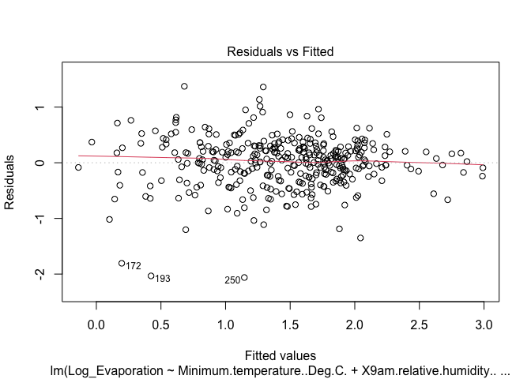<!-- -->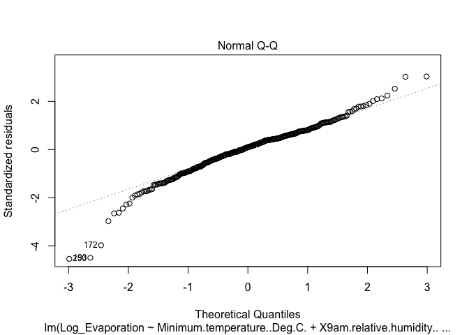<!-- -->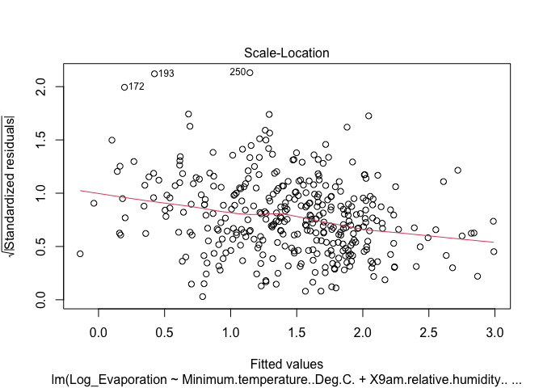<!-- -->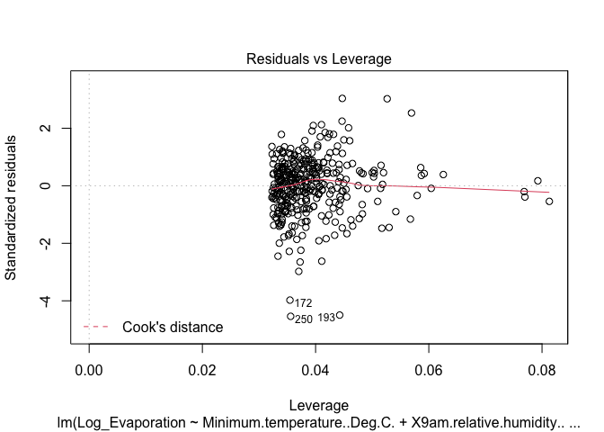<!-- -->
1. Residuals vs Fitted

This plot is designed to check if the relationship is non-linear (for
example exponential). In this case, the residual errors are spread
randomly above and below the line, which means the assumption of
linearity holds.

2.  Normal Q-Q

This plot is designed to test whether the residuals confirm to a normal
distribution shape (represented by the straight line). We see that for
the vast majority of residuals, a normal distribution holds, though
there are some outliers at the extremes. So the normal distribution of
residuals holds.

3.  Scale-Location

This plot is designed to test for hetroscedasticity. We can see a slight
downwards trend in the red line, indicating that variance was not
exactly even, variance had a tendency to decrease for larger fitted
values. In this case, the trend is not so severe that we should reject
the hypothesis of homocedasticity.

4.  Residuals vs Leverage

This plot is designed to help identify influential outliers that may be
skewing the model. Though there are some outliers in the data, this does
not look to have skewed the model, as the red line is not attracted to
those points significantly.

Other linear model assumptions: Independence - Currently, we have no
basis to assume that the observations were not indepedent. Independence
can be violated by changes in measurement device or methodology, where
observations after a certain point in time will be similar to each other
in ways they aren’t to observations prior to the change. In this case,
no such changes are noted.

Predictions:

• February 29, 2020, if this day has a minimum temperature of 13.8
degrees and reaches a maximum of 23.2 degrees, and has 74% humidity at
9am. • December 25, 2020, if this day has a minimum temperature of 16.4
degrees and reaches a maximum of 31.9 degrees, and has 57% humidity at
9am. • January 13, 2020, if this day has a minimum temperature of 26.5
degrees and reaches a maximum of 44.3 degrees, and has 35% humidity at
9am. • July 6, 2020, if this day has a minimum temperature of 6.8
degrees and reaches a maximum of 10.6 degrees, and has 76% humidity at
9am.

As mentioned earlier, our final model, model3 does not use maximum
temperature, so we will only use 3 features, the Month (02), the minimum
temperature (13.8) and the relative humidity at 9am (74).

``` r
Month <- c("02", "12", "01", "07")
Minimum.temperature..Deg.C. <- c(13.8, 16.4, 26.5, 6.8)
X9am.relative.humidity.... <- c(74, 57, 35, 76)
                     
preds <- data.frame(Month, Minimum.temperature..Deg.C., X9am.relative.humidity....)

preds  <- 
  preds %>%
  mutate(Month = factor(Month))

preds$Log_Evaporation <- predict(model3, preds)

preds$Evaporation..mm. <- exp(preds$Log_Evaporation)

conf <- predict(model3, preds, interval="prediction", level=0.95) 

exp(conf)
```

    ##         fit       lwr       upr
    ## 1  5.182714 2.0512887 13.094465
    ## 2  7.653428 3.0302527 19.330058
    ## 3 22.330424 8.7228915 57.165429
    ## 4  1.945993 0.7694091  4.921815

Predictions with confidence:

• February 29, 2020, if this day has a minimum temperature of 13.8
degrees and reaches a maximum of 23.2 degrees, and has 74% humidity at
9am, the model has 95% confidence the Evaporation..mm. will be between
4.34mm and 6.19mm, predicting 5.18mm. • December 25, 2020, if this day
has a minimum temperature of 16.4 degrees and reaches a maximum of 31.9
degrees, and has 57% humidity at 9am, the model has 95% confidence the
Evaporation..mm. will be between 6.42mm and 9.12mm, predicting 7.65mm. •
January 13, 2020, if this day has a minimum temperature of 26.5 degrees
and reaches a maximum of 44.3 degrees, and has 35% humidity at 9am, the
model has 95% confidence the Evaporation..mm. will be between 17.62mm
and 28.29mm, predicting 22.33mm. • July 6, 2020, if this day has a
minimum temperature of 6.8 degrees and reaches a maximum of 10.6
degrees, and has 76% humidity at 9am, the model has 95% confidence the
Evaporation..mm. will be between 1.62mm and 2.34mm, predicting 1.95mm.

Sense checking our prediction results, January 13 2020 is a day with
high minimum temperature, low humidity, and is a summer month, so a high
amount of evaporation is logical given the relationships we have
explored. July 6 2020 is a day with low minimum temperature, high
humidity, and is a winter month, so a low amount of evaporation is also
logical given the same relationships.

Only January 13 2020 shows a 95% confidence for exceeding 10mm of
evaporation at MWC’s Cardinia Reservoir, where the corporation might
need to take temporary measures. For the three dates, there is over 95%
probability of those conditions not requiring the temporary measures.
